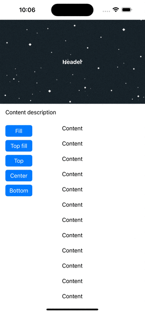
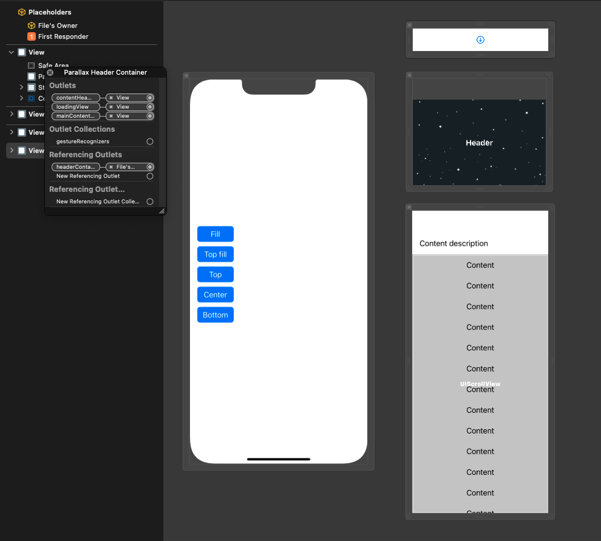

# HParallaxHeader

HParallaxHeader is a simple version from:
- https://github.com/maxep/MXParallaxHeader 
- https://github.com/ngochiencse/HPParallaxHeader.

HPParallaxHeader is a simple view which contains header and can recognize sub scroll views automatically.


|             Demo                |
|---------------------------------|
||

## Usage

+ Inheriting your content view with HParallaxHeader and connect header, content and loading (optional), e.g:

```swift
let headerContainer = HParallaxHeader()

headerContainer.contentHeaderView = headerMain
headerContainer.mainContentView = contentMain
headerContainer.loadingView = loadingMain
headerContainer.headerContainerView.headerHeight = 100

```

+ Or simply drag and drop the outlet to your view on xib 




## Installation

### Swift Package Manager 

You can use  [Swift Package Manager](https://swift.org/package-manager/)  directly within Xcode or add it to the `dependencies` value of your `Package.swift`.

```swift
dependencies: [
    .package(url: "https://github.com/traitanhong98/ParallaxHeader", branch: "main")
]
```

## Author

[Hoang Nguyen](https://github.com/traitanhong98)


## License

HParallaxHeader is available under the MIT license. 

